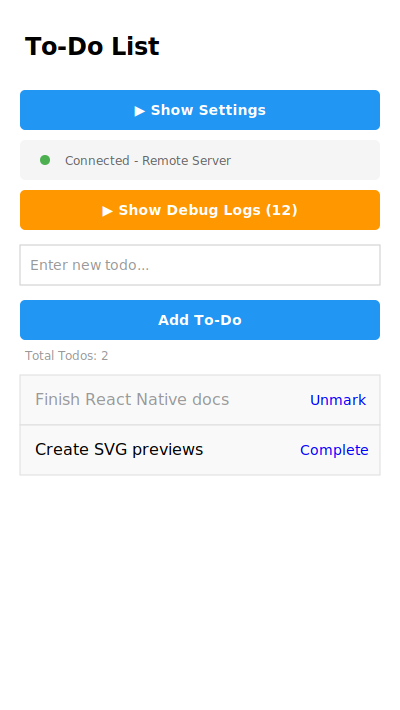

# 📝 My Todo App

[](https://github.com/mohammadfirmansyah/myTodoApp)
[](https://reactnative.dev/)
[](https://expo.dev/)
[](LICENSE)

A complete React Native Todo List application with full CRUD operations and **real-time synchronization**, built with Expo and integrated with a RESTful API backend. This project demonstrates modern mobile app development practices with WebSocket-powered live updates across all connected devices.

## 📚 Documentation

- **[Contributing Guide](CONTRIBUTING.md)** - Learn how to contribute to this project
- **[Changelog](CHANGELOG.md)** - Version history and release notes
- **[Build Information](BUILD_INFO.md)** - Build and deployment guide
- **[License](LICENSE)** - MIT License details

## ✨ Key Features

- **Real-time Sync**: WebSocket connection for instant updates across clients.
- **Dual Server Config**: Switch between local and remote servers for flexible development.
- **Comprehensive Debugging**: In-app debug panel to monitor logs and connection status.
- **CRUD Operations**: Full create, read, update, and delete functionality.
- **Error Handling**: Graceful error handling with user-friendly alerts.
- **Loading States**: Visual feedback during data fetching.

## 📱 App Preview



## 🛠️ Technologies Used

- **React Native** - v0.81.5 - Cross-platform mobile framework
- **Expo** - v54.0.20 - Development platform and toolchain
- **Socket.IO Client** - v4.8.1 - Real-time bidirectional communication
- **JavaScript** - Programming language
- **Axios** - v1.12.2 - HTTP client for API requests
- **REST API** - Backend integration (Node.js/Express/SQLite)
- **React Hooks** - useState, useEffect for state management

## 📂 Project Structure

```
myTodoApp/
├── App.js              # Main application with CRUD, WebSocket, and debug system
├── package.json        # Dependencies and project configuration
├── app.json            # Expo configuration
├── index.js            # Application entry point
├── assets/             # Images, fonts, and static resources
├── .expo/              # Expo build artifacts
├── BUILD_INFO.md       # Build and deployment documentation
├── CHANGELOG.md        # Version history
├── CONTRIBUTING.md     # Contribution guidelines
├── LICENSE             # MIT License
├── README.md           # Project documentation
└── release-notes.md    # Latest release information
```

## 🚀 Setup & Installation

Before you begin, make sure you have the following installed:
- **Node.js** >= 18.0
- **npm** or **yarn**
- **Expo CLI** (installed globally or via npx)

Follow these steps to get your development environment running:

1.  **Clone the repository:**
    ```bash
    git clone https://github.com/mohammadfirmansyah/myTodoApp.git
    cd myTodoApp
    ```

2.  **Install dependencies:**
    ```bash
    npm install
    ```

3.  **Configure API Server:**

    The app includes a built-in **Settings UI** for easy server configuration:
    
    - **No code changes needed!** Configure directly in the app
    - Default: Remote server (IBM Code Engine)
    - Switch to local server with toggle button
    - Custom server URL input for your own backend

## 💻 Usage / How to Run

1.  **Start the Expo development server:**
    ```bash
    npm start
    ```
    or
    ```bash
    npx expo start
    ```

2.  **Run on your preferred platform:**
    - Press `a` for Android emulator
    - Press `i` for iOS simulator (macOS only)
    - Press `w` for web browser
    - Scan QR code with Expo Go app on your physical device

3.  **Test the app:**
    - Add new tasks using the input field
    - Mark tasks as completed by tapping "Complete"
    - Delete tasks by tapping "Delete"
    - All changes sync with the backend API

## 🔄 Real-time Synchronization

This app implements WebSocket-based real-time synchronization with the backend server. Any changes made on one device instantly appear on all other connected devices.

### Architecture Diagram

```
┌──────────────────────────────────────────────────────────────────────┐
│              Mobile App ↔ Backend Real-time Flow                     │
└──────────────────────────────────────────────────────────────────────┘

┌────────────────┐                                    ┌─────────────────┐
│  React Native  │                                    │  Express Server │
│   Mobile App   │                                    │   + Socket.IO   │
└────────┬───────┘                                    └────────┬────────┘
         │                                                     │
         │ 1. Component Mount: useEffect()                    │
         │────────────────────────────────────────────────────►│
         │    io.connect('http://localhost:3000')             │
         │                                                     │
         │                         2. WebSocket Handshake     │
         │◄────────────────────────────────────────────────────│
         │                            Connection Established   │
         │                                                     │
         │ 3. User Action: addTodo()                          │
         │────────────────────────────────────────────────────►│
         │    axios.post('/todos', {title})                   │
         │                                                     │
         │                                  4. Save to SQLite  │
         │                                         │           │
         │ 5. HTTP Response                        ▼           │
         │◄────────────────────────────────────────────────────│
         │    {id: 1, title: "...", completed: 0}             │
         │                                                     │
         │                    6. Broadcast to ALL clients      │
         │                         io.emit('todos-updated')    │
         │                                                     │
         │ 7. Receive Update via WebSocket                    │
         │◄────────────────────────────────────────────────────│
         │    socket.on('todos-updated', todos)               │
         │                                                     │
         │ 8. Update State: setTodos(updatedTodos)            │
         │    → UI re-renders automatically                   │
         │    → No manual refresh needed! ✓                   │
         │                                                     │

Key: ──► HTTP Request    ◄── HTTP Response    ◄──► WebSocket
```

### Client-Side Implementation

```javascript
// Initialize Socket.IO connection on app startup
useEffect(() => {
  const socketInstance = io(SOCKET_URL, {
    transports: ['websocket'],
    reconnection: true,
  });

  // Listen for real-time updates from server
  socketInstance.on('todos-updated', (updatedTodos) => {
    console.log('📡 Real-time update received');
    setTodos(updatedTodos);
  });

  return () => {
    socketInstance.disconnect(); // Cleanup on unmount
  };
}, []);
```

### Benefits

- ✅ **Instant Updates** - Changes appear immediately without refresh
- ✅ **Multi-device Sync** - Test on web browser, iOS, and Android simultaneously
- ✅ **Automatic Reconnection** - Handles network interruptions gracefully
- ✅ **No Manual Refresh** - Data stays current automatically

### Testing Real-time Sync

1. Start backend server: `node index.js` in backend directory
2. Launch app on multiple platforms (web + mobile simultaneously)
3. Make changes on one platform
4. Watch updates appear instantly on all other platforms!

## �📝 Code Highlights

### CRUD Operations with Axios

Here's how the app handles API communication:

```javascript
// Fetch all todos from the backend
const fetchTodos = async () => {
  try {
    const response = await axios.get(API_URL);
    setTodos(response.data);
  } catch (error) {
    Alert.alert('Error', 'Failed to fetch todos');
  }
};

// Add a new todo item
const addTodo = async () => {
  if (!newTodo.trim()) return;
  try {
    const response = await axios.post(API_URL, { title: newTodo });
    setTodos([...todos, response.data]);
    setNewTodo('');
  } catch (error) {
    Alert.alert('Error', 'Failed to add todo');
  }
};
```

*This pattern demonstrates proper async/await usage with comprehensive error handling, ensuring a robust user experience even when network issues occur.*

### State Management

```javascript
// React Hooks for local state management
const [todos, setTodos] = useState([]);
const [newTodo, setNewTodo] = useState('');

// Fetch data on component mount
useEffect(() => {
  fetchTodos();
}, []);
```

*Using React Hooks provides a clean, functional approach to state management without the complexity of external state libraries.*

### Dynamic Server Configuration

```javascript
// Settings UI - Dynamic server switching without code changes
const [useLocalServer, setUseLocalServer] = useState(false);
const [customUrl, setCustomUrl] = useState('');

// Automatically update API and Socket URLs when settings change
const API_URL = customUrl.trim() 
  ? `${customUrl}/todos`
  : useLocalServer 
    ? `http://${Platform.OS === 'android' ? '10.0.2.2' : 'localhost'}:3000/todos`
    : 'https://todolist.220fii1j0spm.us-south.codeengine.appdomain.cloud/todos';

const SOCKET_URL = customUrl.trim()
  ? customUrl
  : useLocalServer
    ? `http://${Platform.OS === 'android' ? '10.0.2.2' : 'localhost'}:3000`
    : 'https://todolist.220fii1j0spm.us-south.codeengine.appdomain.cloud';
```

*This pattern enables runtime configuration changes, perfect for testing different environments without rebuilding the app.*

### Debug Panel with Color-Coded Logging

```javascript
// Comprehensive logging system for debugging
const addLog = (message, type = 'INFO') => {
  const timestamp = new Date().toLocaleTimeString();
  setDebugLogs(prev => {
    const newLogs = [...prev, { message, type, timestamp }];
    return newLogs.slice(-50); // Keep last 50 logs
  });
};

// 7 event types: API, SOCKET, CONFIG, DATA, ERROR, FALLBACK, WARN
addLog('Fetching todos from server...', 'API');
addLog(`Socket connected to ${SOCKET_URL}`, 'SOCKET');
addLog(`Switched to ${useLocalServer ? 'Local' : 'Remote'} Server`, 'CONFIG');
```

*Color-coded logging provides real-time visibility into app behavior, essential for debugging sync issues and network problems.*

## 📖 Learning Outcomes

This project is an excellent demonstration of:

- ✅ **React Native Fundamentals**: Building mobile UIs with components and styling
- ✅ **API Integration**: Consuming RESTful APIs with Axios
- ✅ **Async Operations**: Handling asynchronous JavaScript with async/await
- ✅ **State Management**: Managing component state with React Hooks
- ✅ **Error Handling**: Implementing user-friendly error messages
- ✅ **CRUD Operations**: Complete Create, Read, Update, Delete functionality
- ✅ **Mobile UX**: Designing intuitive mobile user interfaces
- ✅ **Cross-Platform Development**: Writing once, running everywhere with React Native

## 🔧 Server Configuration

### Built-in Settings UI

The app includes a **Settings Panel** in the user interface for easy server configuration - **no code changes needed!**

#### How to Configure Server

1. **Open the app** - Settings panel is at the top of the screen
2. **Toggle between servers**:
   - **Use Remote Server** - Production API (IBM Code Engine)
   - **Use Local Server** - Your local backend at localhost:3000
3. **Custom Server URL** - Enter your own backend URL if needed
4. **Debug Panel** - Monitor real-time API and Socket.IO events

#### Available Server Options

**Remote Server (Default):**
- Base URL: `https://todolist.220fii1j0spm.us-south.codeengine.appdomain.cloud`
- Deployed on IBM Code Engine
- No local backend required
- Works from anywhere

**Local Server:**
- Base URL: `http://localhost:3000`
- Requires local backend server running
- Best for development and testing

**Custom Server:**
- Enter any valid URL in the input field
- Useful for testing different environments
- Supports both HTTP and HTTPS

#### Server Features

The app includes:

- **Settings UI** - Toggle between local/remote servers without code changes
- **Debug Panel** - Color-coded logging system (API/SOCKET/CONFIG/DATA/ERROR/FALLBACK/WARN)
- **Connection Status Indicator** - Visual feedback showing connected/disconnected state
- **Environment Display** - Shows which server you're connected to
- **Error Handling** - Displays detailed error messages with retry option
- **Loading States** - Shows loading spinner while fetching data
- **Automatic Retry** - Retry button for failed connections
- **Timeout Configuration** - 10-second timeout for API requests
- **Fallback Mechanism** - 300ms timeout before manual refresh on sync issues

#### API Endpoints

- **GET** `/todos` - Fetch all todos
- **POST** `/todos` - Create a new todo (body: `{ title: string }`)
- **PUT** `/todos/:id` - Update a todo (body: `{ title: string, completed: boolean }`)
- **DELETE** `/todos/:id` - Delete a todo

**Note for Android Emulator**: If using local server, the app automatically detects Android environment and uses `10.0.2.2` instead of `localhost` for proper connectivity.

## 🤝 Contributing

We welcome contributions! Please feel free to submit a Pull Request.

1.  Fork the repository
2.  Create your feature branch (`git checkout -b feature/AmazingFeature`)
3.  Commit your changes (`git commit -m 'Add some AmazingFeature'`)
4.  Push to the branch (`git push origin feature/AmazingFeature`)
5.  Open a Pull Request

## 📄 License

This project is licensed under the MIT License. See the LICENSE file for details.

## 👨‍💻 Developer

- **Mohammad Firman Syah**
- **Project Link:** [https://github.com/mohammadfirmansyah/myTodoApp](https://github.com/mohammadfirmansyah/myTodoApp)
- **Backend Repository:** [https://github.com/mohammadfirmansyah/ltsqj-crud_todo_sqlite](https://github.com/mohammadfirmansyah/ltsqj-crud_todo_sqlite)

---

**Note**: This app requires a running backend server. For production deployment, consider:
- Replacing `localhost` with your deployed API URL
- Adding authentication and authorization
- Implementing offline mode with local storage
- Adding loading states and optimistic UI updates
- Implementing pull-to-refresh functionality
